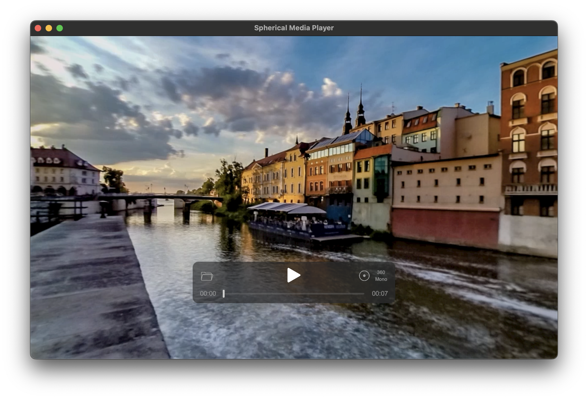

# Spherical Media Player

Spherical Video / Photo Player for macOS.  
Other common players also support spherical media, but they rely on specific metadata. This program can play these media as spherical without needing it.

Made with Unity.

## Download

Please download latest version from [Releases](https://github.com/yutokun/Spherical-Media-Player/releases).

## Features / Roadmap

- [x] 360/180, Mono/Stereoscopic Video Playback
- [x] 360/180, Mono/Stereoscopic Photo Viewing
- [x] Recentering
- [x] Info Overlay
- [x] Remembering Projection Mode for files
- [x] QuickTime Style UI
- [ ] "Open With" support
- [x] Sparkle Updater
- [ ] Keyboard Controls
    - [x] Space - Play/Pause

## Not Planned

- VR Headset Support
- Windows Release (Because Movies & TV app has 360 video support)
- Detailed Video Info

## License

### [Unity Standalone File Browser](https://github.com/gkngkc/UnityStandaloneFileBrowser)

MIT License  
Copyright (c) 2017 Gökhan Gökçe

### [UniTask](https://github.com/Cysharp/UniTask)

The MIT License (MIT)  
Copyright (c) 2019 Yoshifumi Kawai / Cysharp, Inc.

### [NuGetForUnity](https://github.com/GlitchEnzo/NuGetForUnity)

MIT License  
Copyright (c) 2018 Patrick McCarthy

### [R3](https://github.com/Cysharp/R3)

MIT License  
Copyright (c) 2024 Cysharp, Inc.

### [StbImageSharpForUnity](https://github.com/mochi-neko/StbImageSharpForUnity)

MIT License  
Copyright (c) 2022 mochineko

### [Sparkle](https://github.com/sparkle-project/Sparkle)

Copyright (c) 2006-2013 Andy Matuschak.  
Copyright (c) 2009-2013 Elgato Systems GmbH.  
Copyright (c) 2011-2014 Kornel Lesiński.  
Copyright (c) 2015-2017 Mayur Pawashe.  
Copyright (c) 2014 C.W. Betts.  
Copyright (c) 2014 Petroules Corporation.  
Copyright (c) 2014 Big Nerd Ranch.

### Movie in the screenshot above

https://www.mettle.com/360vr-master-series-free-360-downloads-page/